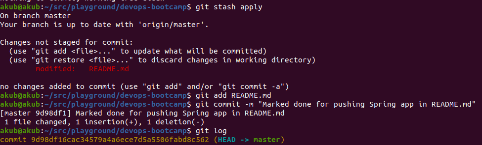

## Git Commands Demo 

This is a demonstration of basic Git commands as instructed in [README_Git.md](https://github.com/shubhamkushwah123/DevOps_README/blob/master/README_Git.md)

> Git Version, Git Config and Git Clone

> Git Pull

> Repository at remote in initial state

> After modification on remote repository

> Git Fetch, Git Pull, Git Status

> Git Add, Git Commit

> Git Push

> Updated remote repository after push operation

> Git Branch, Git Checkout 

> Git Merge

> Git Stash

> Git Stash Apply

> Git Log, Git Rebase

> Git Log after rebasing dev on master branch

> Git Revert

